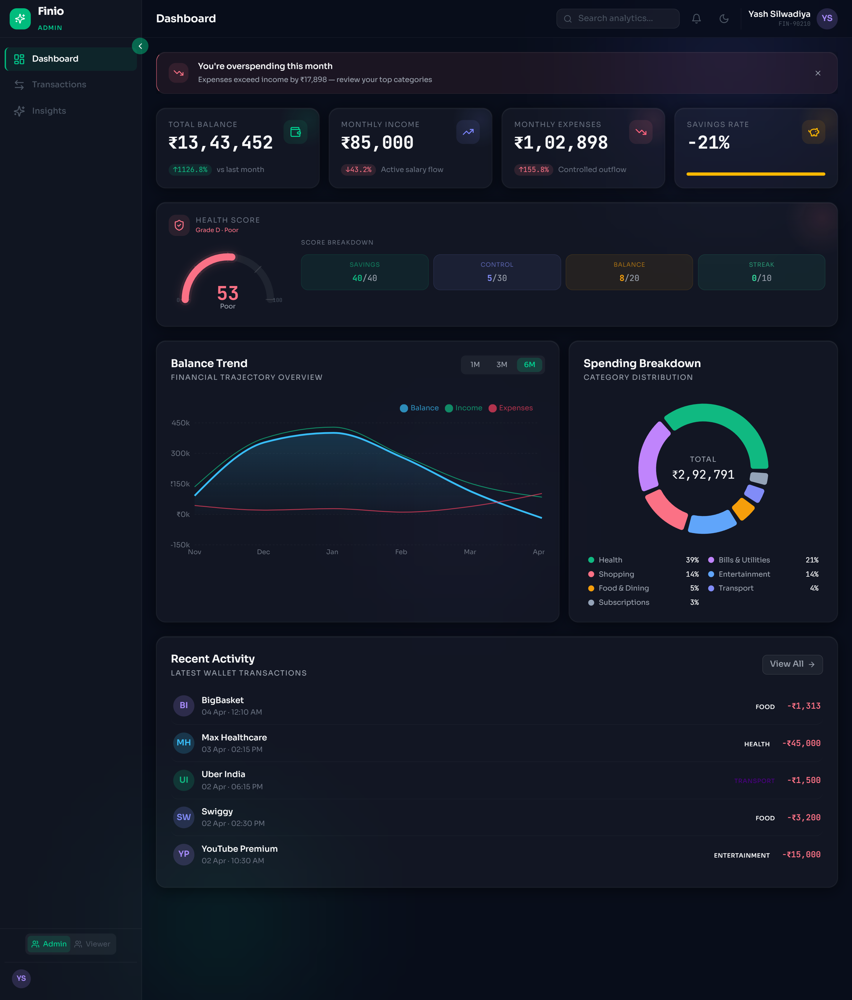

# Finio — AI Finance Dashboard



Finio is a modern, responsive, and beautifully designed AI Finance Dashboard built for a FinTech internship assignment. It uses a premium "glassmorphism" design system, smooth framer-motion animations, and deeply interactive data visualizations to give users immediate insights into their financial health.

## ✨ Key Features
- **Modern Glassmorphism UI:** Built with Tailwind CSS using customized backdrop blur effects and rich token-based styling.
- **Dynamic Dashboards & Analytics:** Interactive charts powered by Recharts (Area charts, Donut charts) to break down transactions.
- **Robust State Management:** Local global state powered by Zustand, ensuring lightning-fast updates across components without prop-drilling.
- **Smart Financial Engine:** Automatic generation of a "Health Score", anomaly detection, and spending trend analysis.
- **Responsive Empty States:** Designed explicitly to gracefully handle the absence of data using animated fallback states.
- **100% Mocked Data:** Uses `@faker-js/faker` to generate thousands of realistic, structured transactions on the fly—meaning no local database setup is required.

## 🚀 Getting Started

Since Finio is 100% local and mocked, **no API keys or environment variables** are required!

### 1. Clone the Repository
```bash
git clone https://github.com/yash8709/Finio.git
cd Finio
```

### 2. Install Dependencies
```bash
npm install
```

### 3. Run the Development Server
```bash
npm run dev
```

Your app will instantly be live at `http://localhost:5173`.

## 🛠️ Technology Stack
* **Framework:** React 19 + Vite
* **Language:** TypeScript (Strict Mode)
* **Styling:** Tailwind CSS v4
* **Animations:** Framer Motion
* **State Management:** Zustand
* **Icons:** Lucide React
* **Charts:** Recharts

## 📐 Architecture Note
The project structure is meticulously organized by domains to ensure scalability:
- `src/components/ui/` -> Reusable, standard-agnostic design system components.
- `src/utils/` -> Pure functions for data-crunching, formatting, and analysis.
- `src/store/` -> Global Zustand stores handling the source of truth for mock data generation and UI toggles.
- `src/pages/` -> Top-level routing components mapping to Views (Dashboard, Transactions, Insights).

> **Evaluator's Note:** The `.env.example` file is included as proof-of-concept for how production scaling would handle secure variables (like an external auth or Postgres connection), despite this iteration intentionally relying entirely on in-browser mocked data.
